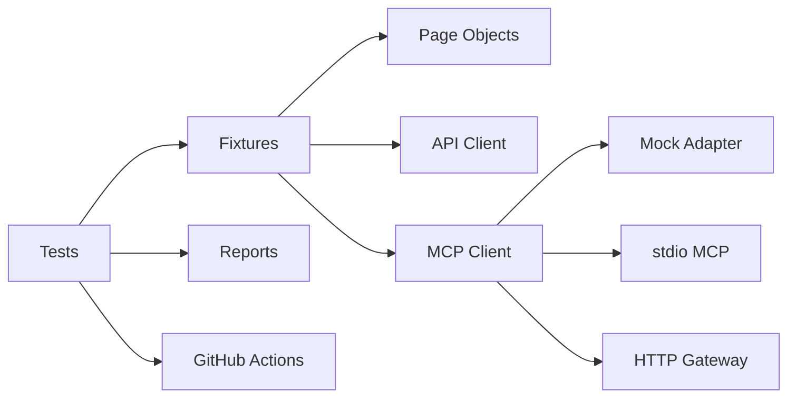

# AI-Driven Automation Framework with Playwright + JavaScript + MCP


A professional Proof of Concept framework for **UI automation, API automation, lightweight contract checks, and MCP-ready AI integration** using Playwright with JavaScript.

## Why this repo is strong for job search

- Demonstrates Playwright for both UI and API automation in one framework.[page:1]
- Uses page objects and modular framework design to improve maintainability, which aligns with Playwright-oriented POM guidance that page objects should encapsulate interactions and keep test logic out of implementation details.[web:27][web:24]
- Separates an MCP adapter from test cases so AI integration can evolve without locking the framework to one provider.[web:23][web:26]
- Includes Docker and CI to make the framework portable and enterprise-friendly.[web:22][web:31]

## Architecture



The repo keeps UI, API, contract, and hybrid flows in separate test layers while reusing common fixtures and utilities. Playwright supports API testing through `APIRequestContext`, including API-only validation, server-side setup before UI tests, and checking server state after UI actions.[page:1]

## Included scenarios

### UI
- Valid login.
- Locked user negative login.
- Invalid credential validation.
- Add product to cart.

### API
- GET users list.
- GET single user.
- POST create user.
- Negative register scenario.

### Hybrid
- Login through UI and validate API in the same scenario, which reflects a practical pattern supported by Playwright's API testing model.[page:1]

### Contract
- Lightweight response structure checks for GET and POST user flows.

## MCP placeholder options

The framework ships with three placeholder integration paths:

1. Mock adapter, for deterministic local development.
2. stdio MCP client, for local MCP servers typically used by agent tools.[web:23][web:26]
3. HTTP gateway, for internal AI orchestration services.

These are placeholders by design so you can present a working framework now and then plug in a real MCP provider later.

## Docker

Playwright documents recommend Docker settings such as `--init` to avoid PID 1 process issues and `--ipc=host` for Chromium stability in containers.[web:22] The Docker setup here uses the official Playwright image and the compose file includes `init: true` and `ipc: host` in line with that guidance.[web:22][web:31]

## Project structure

```text
src/
  config/
  core/
    ai/
    api/
    mcp/
    reporting/
    utils/
  fixtures/
    pages/
    components/
  test-data/

tests/
  ui/
  api/
  contract/
  e2e/

docs/
scripts/
.github/workflows/
```

## Setup

```bash
npm install
npx playwright install
cp .env.example .env
```

## Run

```bash
npm test
npm run test:ui
npm run test:api
npm run test:e2e
npm run test:contract
npm run test:smoke
npm run mcp:demo
npm run mcp:inspector
```

## Reports

```bash
npm run report:allure      # Generate Allure report
npm run report:allure:serve # Serve Allure report locally
npm run report              # Playwright HTML report
```

## Docker run

```bash
docker build -t ai-playwright-mcp-framework .
docker run --init --ipc=host ai-playwright-mcp-framework
```

## Suggested GitHub polish

- Add screenshots of Playwright HTML report.
- Add a release tag after first stable run.
- Add issues for roadmap items such as self-healing locators, trace triage, and AI-generated regression packs.
- Record a short demo video for recruiters.

## References

- Playwright API testing supports direct API requests and mixed UI plus API workflows.[page:1]
- Playwright Docker guidance recommends `--init` and `--ipc=host` for reliable Chromium execution.[web:22]
- Matching Docker image version with Playwright version helps avoid browser executable mismatches.[web:31]
