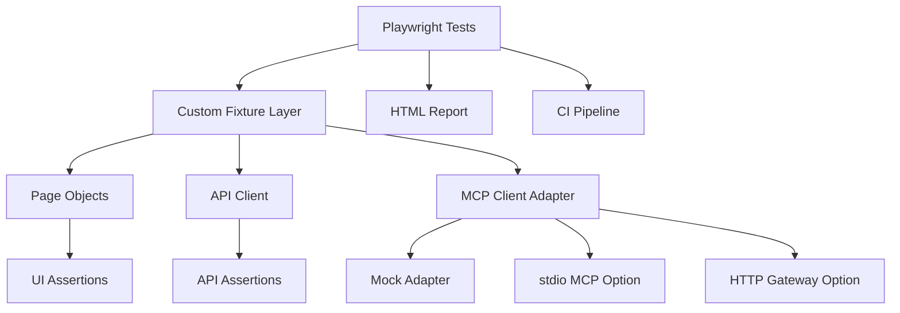

# Architecture

## Notes
- Tests are split into UI, API, contract, and hybrid end-to-end coverage.
- MCP is isolated behind a client adapter so vendor changes do not affect test files.
- API and UI share the same framework and reporting model.
